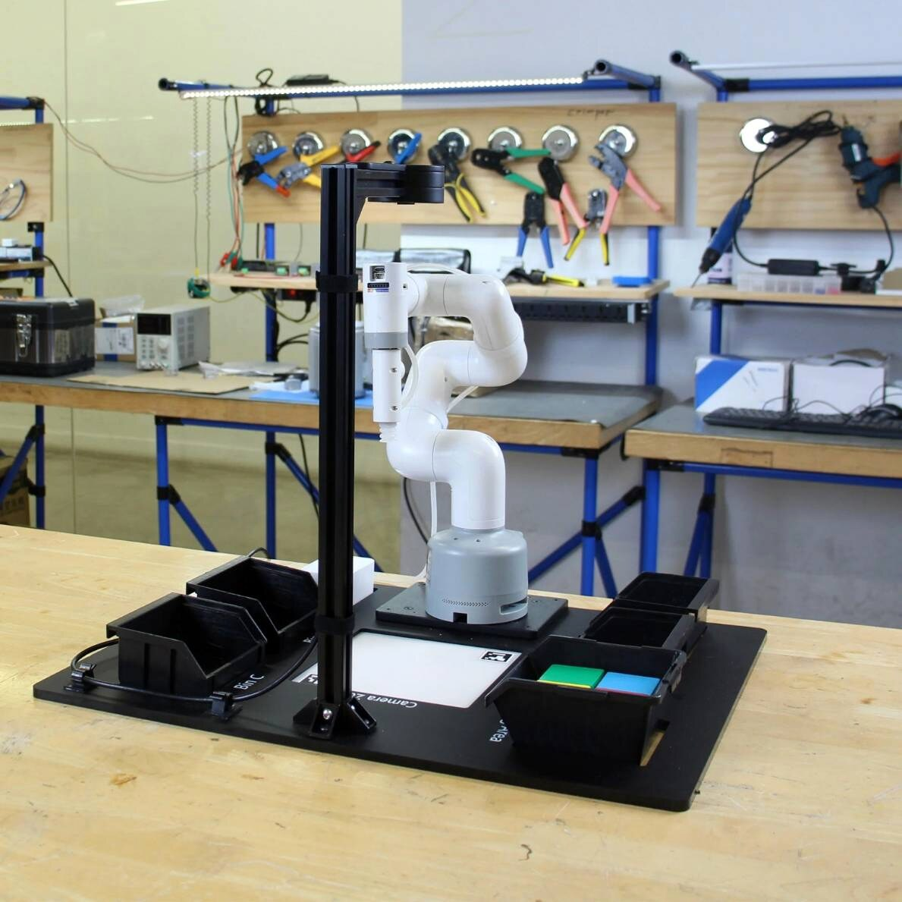
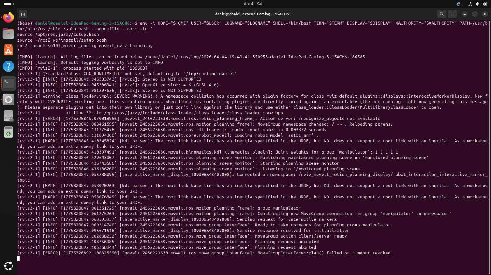
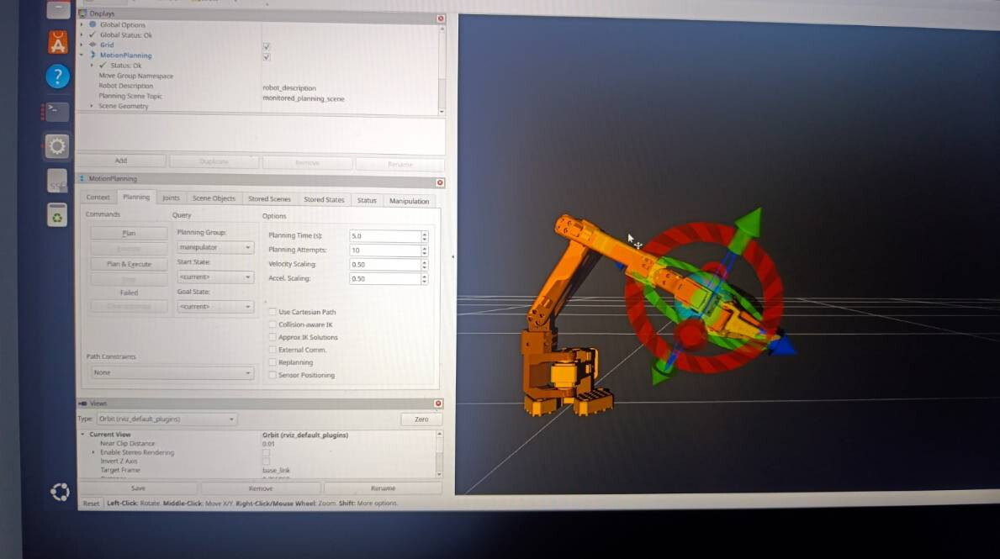
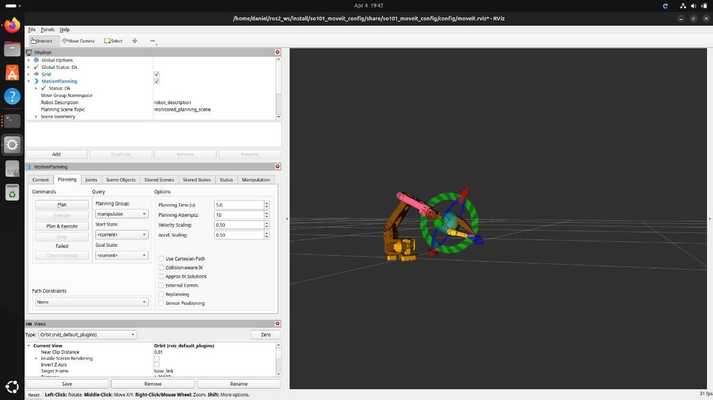
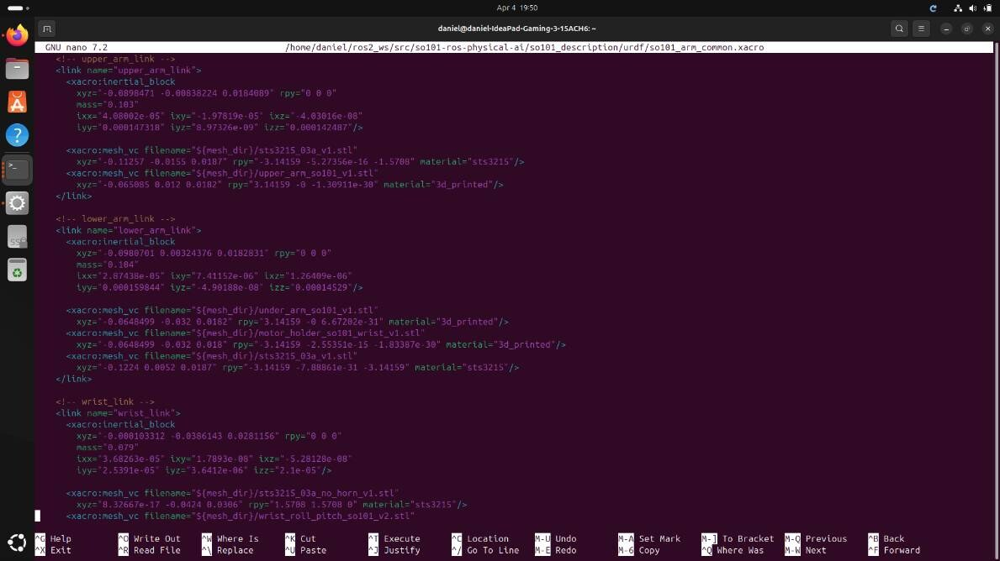
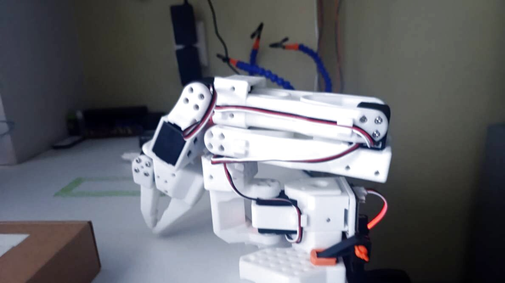

# SO-101 → ROS 2 + MoveIt — Full Bring-Up Guide

A complete, step-by-step path for taking a **real SO-101 / SO-ARM101 leader–follower arm** from an empty PC all the way to **MoveIt motion planning on the physical robot** — using **LeRobot** (teleoperation + imitation learning) and **ROS 2 Jazzy**.

This is the exact route I went through, with the real commands, the real terminal output, and honest notes about what worked and what is still being fixed. If you follow it top to bottom you should be able to reproduce the same setup. Everything you need to install on your PC and inside Ubuntu is collected here in one place.

> ⚠️ **Honest status:** the LeRobot half (teleop → dataset → ACT policy → Hugging Face) is complete and working. The ROS 2 + MoveIt half is **stood up and exercised on the real arm** — controllers load, MoveIt plans and sends goals, all 6 channels move the robot — but **end-to-end pose correctness is not finished**: the real arm and the RViz/MoveIt model do not yet fully agree because of a calibration/joint-semantics mismatch. Read Part C before you trust any motion on hardware.

> 🖼️ **Note on images:** the screenshots below are only used where I actually captured the real screen (ROS 2 launch, RViz/MoveIt, URDF editing, the physical robot). The LeRobot steps are documented with the exact commands and real log output instead of screenshots.

---

## Contents

1. [What you need (hardware + software)](#1-what-you-need)
2. [Part A — LeRobot on WSL2 / Ubuntu](#2-part-a--lerobot)
   - [A1. Install Ubuntu + LeRobot](#a1-install-ubuntu--lerobot)
   - [A2. Find ports & set up the motors](#a2-find-ports--set-up-the-motors)
   - [A3. Calibrate both arms](#a3-calibrate-both-arms)
   - [A4. Teleoperation (leader → follower)](#a4-teleoperation)
   - [A5. Cameras](#a5-cameras)
   - [A6. Record a dataset](#a6-record-a-dataset)
   - [A7. Replay (sanity check)](#a7-replay)
   - [A8. Train an ACT policy + push to Hugging Face](#a8-train-an-act-policy)
   - [A9. Run / evaluate the policy](#a9-run-the-policy)
3. [Part B — Native Ubuntu 24.04 + ROS 2 Jazzy](#3-part-b--ros-2)
   - [B1. Why move off WSL](#b1-why-move-off-wsl)
   - [B2. Install ROS 2 Jazzy + build the workspace](#b2-install-ros-2-jazzy)
   - [B3. Bring up the real hardware](#b3-bring-up-the-real-hardware)
   - [B4. MoveIt](#b4-moveit)
4. [Part C — The calibration chain (the hard part)](#4-part-c--the-calibration-chain)
5. [Lessons learned](#5-lessons-learned)
6. [References](#6-references)

---

## 1. What you need

**Hardware**
- SO-101 / SO-ARM101 **follower** arm (the one that moves) + **leader** arm (the one you move by hand) — 6 Feetech STS3215 bus servos each.
- 2 × USB cameras (I used a wrist camera + an overhead/scene camera).
- A PC with an NVIDIA GPU for training (CUDA), and USB ports for the two arms + cameras.
- *(optional but recommended)* an external SSD if you dual-boot / run native Ubuntu from external storage.



**Software (everything installed below)**
- Ubuntu 24.04 (native) — and/or WSL2 Ubuntu on Windows for the LeRobot stage.
- Miniforge/conda, Python 3.10–3.12.
- **LeRobot** (`huggingface/lerobot`) with the `feetech` extra.
- A Hugging Face account (to host your dataset + trained policy).
- **ROS 2 Jazzy**, `ros2_control`, **MoveIt**, RViz2.

---

## 2. Part A — LeRobot

This whole part can be done on **WSL2 (Ubuntu on Windows)** or on native Ubuntu. WSL2 is fine for teleop, recording, replay and offline training. (For real-time *online* policy inference with two cameras, native Ubuntu was much more reliable — see Part B1.)

### A1. Install Ubuntu + LeRobot

On Windows, install WSL2 first (skip if you already run Ubuntu):

```bash
wsl --install -d Ubuntu        # run in Windows PowerShell, then reboot
```

Inside Ubuntu, install Miniforge (conda), create an environment, and install LeRobot:

```bash
# conda environment
conda create -y -n lerobot python=3.10
conda activate lerobot

# LeRobot with Feetech servo support
git clone https://github.com/huggingface/lerobot.git
cd lerobot
pip install -e ".[feetech]"
```

> **WSL + USB:** WSL2 does not see USB serial devices by default. On Windows install **usbipd-win**, then attach each device to WSL:
> ```powershell
> usbipd list
> usbipd attach --wsl --busid <BUSID>
> ```
> After attaching, the arms appear inside Ubuntu as `/dev/ttyACM0`, `/dev/ttyACM1`, etc.

### A2. Find ports & set up the motors

```bash
lerobot-find-port            # tells you which /dev/ttyACM* is which arm
```

Then write the servo IDs into each motor's EEPROM (do this once per arm, motors connected one chain at a time as the tool instructs):

```bash
lerobot-setup-motors --robot.type=so101_follower --robot.port=/dev/ttyACM0
lerobot-setup-motors --teleop.type=so101_leader  --teleop.port=/dev/ttyACM1
```

### A3. Calibrate both arms

Calibration captures each joint's range and zero. Run it for the follower **and** the leader, giving each an `id` (the calibration is saved under that id and reused everywhere later):

```bash
lerobot-calibrate --robot.type=so101_follower --robot.port=/dev/ttyACM0 --robot.id=my_follower
lerobot-calibrate --teleop.type=so101_leader  --teleop.port=/dev/ttyACM1 --teleop.id=my_leader
```

> 📌 **Remember these ids and the calibration files.** They are the first link in the "calibration chain" that has to stay consistent all the way to MoveIt (Part C).

### A4. Teleoperation

Move the **leader** by hand and the **follower** copies it. This is the first real test that motors, ports and calibration are all correct:

```bash
lerobot-teleoperate \
  --robot.type=so101_follower --robot.port=/dev/ttyACM0 --robot.id=my_follower \
  --teleop.type=so101_leader  --teleop.port=/dev/ttyACM1 --teleop.id=my_leader
```

On my hardware this ran at a stable **~59 Hz**.

### A5. Cameras

Add cameras with `--robot.cameras` (OpenCV backend, by device index). I used two:

```bash
--robot.cameras='{
  front: {type: opencv, index_or_path: 0, width: 640, height: 480, fps: 30},
  side:  {type: opencv, index_or_path: 1, width: 640, height: 480, fps: 30}
}'
```

You can append this flag to the `teleoperate` and `record` commands. Check indices with a quick OpenCV test if the wrong camera shows up.

### A6. Record a dataset

Teleoperate the task and record it. Each "episode" is one demonstration; record several clean ones:

```bash
lerobot-record \
  --robot.type=so101_follower --robot.port=/dev/ttyACM0 --robot.id=my_follower \
  --teleop.type=so101_leader  --teleop.port=/dev/ttyACM1 --teleop.id=my_leader \
  --robot.cameras='{front: {type: opencv, index_or_path: 0, width: 640, height: 480, fps: 30}, side: {type: opencv, index_or_path: 1, width: 640, height: 480, fps: 30}}' \
  --dataset.repo_id GENMES3354/so101_pick_place_2cam_v1 \
  --dataset.num_episodes=10 \
  --dataset.single_task "Pick the box and place it in the green area"
```

My dataset: **10 episodes / 5 972 frames**, 2 cameras. It is uploaded to the Hub at `GENMES3354/so101_pick_place_2cam_v1`.

### A7. Replay

Before training, replay an episode so the **follower** re-executes a recorded demo. If replay looks correct, your data + calibration are sound:

```bash
lerobot-replay \
  --robot.type=so101_follower --robot.port=/dev/ttyACM0 --robot.id=my_follower \
  --dataset.repo_id GENMES3354/so101_pick_place_2cam_v1 \
  --dataset.episode=0
```

### A8. Train an ACT policy

Train an **ACT** (Action Chunking Transformer) policy on the recorded dataset and push the result to the Hub:

```bash
lerobot-train \
  --dataset.repo_id GENMES3354/so101_pick_place_2cam_v1 \
  --policy.type=act \
  --output_dir outputs/train/act_so101_pick_place_2cam_v1 \
  --job_name act_so101_pick_place_2cam_v1 \
  --policy.device=cuda \
  --policy.repo_id GENMES3354/act_so101_pick_place_2cam_v1
```

ACT uses a ResNet-18 vision backbone (~52 M params). I trained for **5 000 steps** on GPU. Real training log — the loss came down cleanly:

```text
step:200    loss:6.157   grad_norm:153.4   lr:1.0e-05
step:600    loss:2.288
step:1000   loss:1.834
step:1400   loss:1.480
step:1800   loss:1.187
step:2200   loss:0.949
...
```

Trained policy: `GENMES3354/act_so101_pick_place_2cam_v1` on Hugging Face.

### A9. Run the policy

Run the trained policy on the real follower (record-with-policy, no leader):

```bash
lerobot-record \
  --robot.type=so101_follower --robot.port=/dev/ttyACM0 --robot.id=my_follower \
  --robot.cameras='{front: {type: opencv, index_or_path: 0, width: 640, height: 480, fps: 30}, side: {type: opencv, index_or_path: 1, width: 640, height: 480, fps: 30}}' \
  --policy.path=GENMES3354/act_so101_pick_place_2cam_v1 \
  --dataset.repo_id GENMES3354/eval_act_so101 \
  --dataset.num_episodes=5
```

> This is where WSL started to struggle: real-time inference with **two camera streams** wasn't reliable. That pushed the move to native Ubuntu.

---

## 3. Part B — ROS 2

### B1. Why move off WSL

WSL2 handled teleop, recording, replay and offline training fine. But for **real-time online inference with two cameras** and for **ROS 2 Jazzy** (which targets Ubuntu 24.04), native Ubuntu was clearly better:

- more reliable USB serial,
- better camera handling,
- stable runtime / timing,
- straightforward ROS 2 install.

So Part B is done on **native Ubuntu 24.04**.

### B2. Install ROS 2 Jazzy

Install ROS 2 Jazzy (desktop) following the official docs, then make it available in every shell:

```bash
echo "source /opt/ros/jazzy/setup.bash" >> ~/.bashrc
source ~/.bashrc
```

Create a workspace and build the SO-101 ROS 2 packages (I built on the open-source `so101-ros-physical-ai` stack — see References):

```bash
mkdir -p ~/ros2_ws/src
cd ~/ros2_ws/src
git clone https://github.com/legalaspro/so101-ros-physical-ai.git
cd ~/ros2_ws
rosdep install --from-paths src --ignore-src -r -y
colcon build --symlink-install
source install/setup.bash
```

### B3. Bring up the real hardware

Launch the follower bring-up. This loads the hardware interface and starts the controllers:

```bash
ros2 launch so101_bringup follower.launch.py
```

Expected controller startup (real log):

```text
[follower.controller_manager] Loading controller 'joint_state_broadcaster'
[follower.controller_manager] Configuring controller: 'joint_state_broadcaster'
[follower.controller_manager] Activating controllers: [ joint_state_broadcaster ]
[follower.controller_manager] Successfully switched controllers!
[follower_command_relay] Leader: /leader/joint_states → Follower JTC: /follower/trajectory_controller/joint_trajectory
[follower_command_relay] Rate: 50.0 Hz, Arm joints: 6
```

Check the controllers are active:

```bash
ros2 control list_controllers
```

You should see `joint_state_broadcaster` and a trajectory controller `active`. Confirm the model in RViz matches the joints, then verify **each commanded channel actually moves the matching real joint** (do this slowly and one joint at a time — see Part C).

### B4. MoveIt

Launch the MoveIt config and RViz:

```bash
ros2 launch so101_moveit_config moveit_rviz.launch.py
```



In RViz, drag the interactive marker to a goal pose, **Plan**, then **Execute** — the trajectory is sent to the real controller.





> ✅ Planning works and goals reach the controller. ⚠️ Whether the **real** arm ends up where the model says it does is the open problem — Part C.

---

## 4. Part C — The calibration chain

The single biggest lesson of this project: **a "green" RViz/MoveIt state does not mean the real robot is correctly calibrated or safe.** A controller can accept a goal, report success, and show a valid pose in RViz while the physical arm is somewhere else entirely.

Joint position has to mean the same thing across **every** layer:

```
servo EEPROM offsets
   → LeRobot calibration JSON
      → ROS 2 controller YAML
         → URDF / Xacro joint axes & limits
            → MoveIt planning model
               → actual mechanical pose of the arm
```

The URDF / Xacro is one of those links — joint axes, limits and inertials all have to be right:



If any link disagrees, the model and the real robot drift apart. How I debug it:

- **Validate joint-by-joint.** Command one channel at a time and watch which *real* joint moves, in which direction, and how far. Don't trust software inspection alone.
- **Compare** the reported `/joint_states` against the physical pose.
- **Define a known-safe reference pose** and always start from it (avoid an unsafe folded-pose jump at startup).



This reconciliation is the part still in progress.

---

## 5. Lessons learned

- **A working teleop demo is only the beginning** of a real robotics integration project.
- **Native Linux beats WSL** for real-time hardware: serial, cameras, timing and online inference all improved.
- **"Works in one stack" ≠ "correct in another."** Good LeRobot teleop did **not** guarantee correct ROS 2 / MoveIt joint semantics.
- **Calibration is a chain, not a file** — all six layers above must agree.
- **Controller "success" ≠ physically correct execution.** Prove what is *actually* moving, not what the software says should move.
- **Safety first:** never execute a planned trajectory on hardware until you've confirmed the model and the real arm agree and you start from a known-safe pose.

---

## 6. References

- **LeRobot** — teleop, dataset recording, replay, ACT training/eval · https://github.com/huggingface/lerobot
- **legalaspro/so101-ros-physical-ai** — ROS 2 / real-hardware bring-up baseline · https://github.com/legalaspro/so101-ros-physical-ai
- **SO-ARM101 MoveIt / Isaac Sim reference** · https://github.com/MuammerBay/SO-ARM101_MoveIt_IsaacSim
- My dataset: `GENMES3354/so101_pick_place_2cam_v1` · My policy: `GENMES3354/act_so101_pick_place_2cam_v1` (Hugging Face)

---

*This guide documents real experiments on physical hardware. Some of the ROS 2 / MoveIt stack is still under active debugging — treat it as an engineering log, not a finished product. If it helps you avoid the same bring-up pitfalls, it did its job.*
