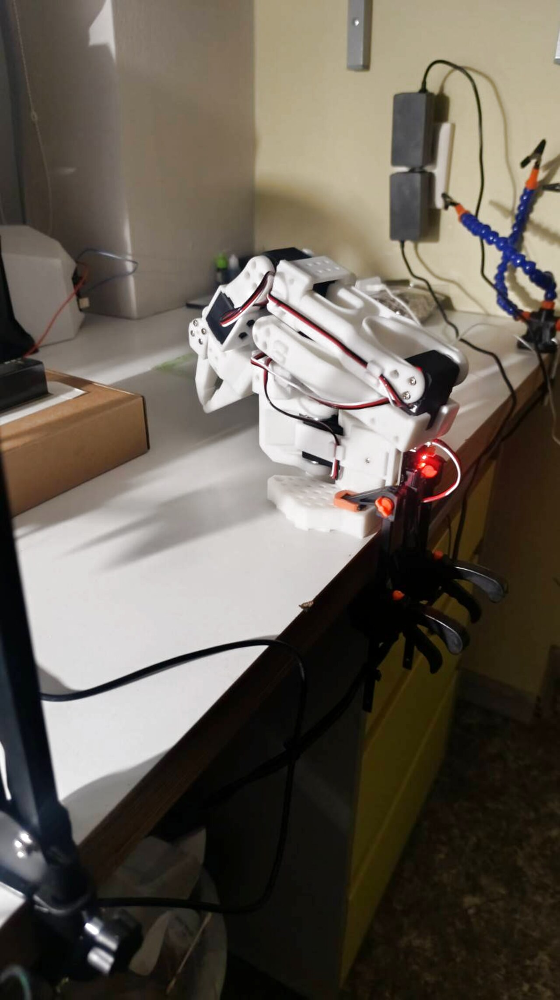
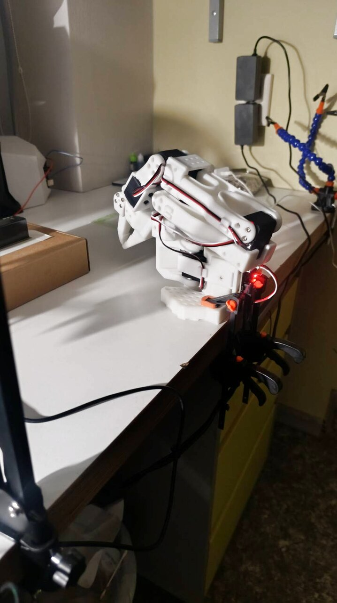
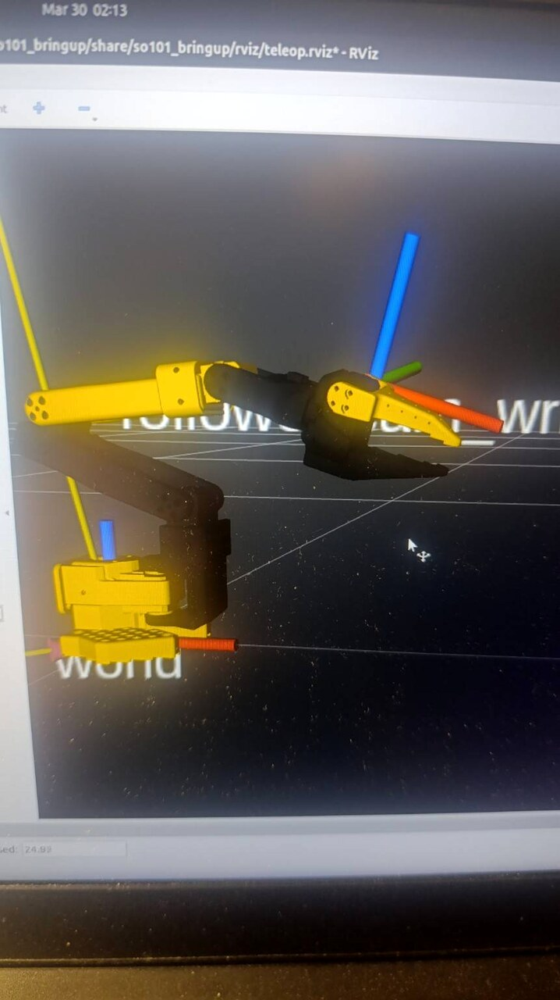
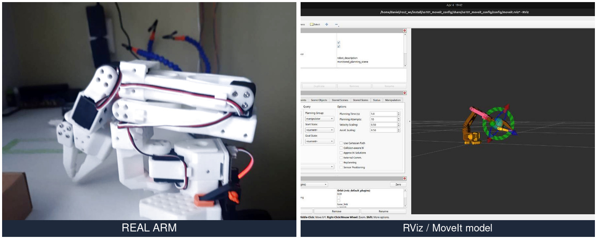

# SO-101 Native Ubuntu ROS 2 MoveIt Bring-Up

> Real-hardware bring-up of a real **SO-101 / SO-ARM101 follower-leader robot** on **native Ubuntu** with **LeRobot**, **ROS 2 Jazzy**, and **MoveIt**.


---

## 🎯 Project goal

This repository documents my practical engineering work on bringing up a **real SO-101 / SO-ARM101 robot pair** and understanding the full integration path step by step.

The goal is not just to “make the demo run”, but to understand and validate the entire stack:

- hardware bring-up
- USB / serial device mapping
- LeRobot teleoperation
- camera setup
- dataset recording and replay
- ACT policy training and evaluation
- migration from WSL to native Ubuntu
- ROS 2 Jazzy bring-up
- MoveIt integration
- real-hardware controller validation
- debugging mismatches between calibration, URDF, ROS 2 state, and physical robot motion

This repository is intended as both:

- a **practical engineering log**
- a **portfolio project** for robotics / mechatronics / controls / systems integration roles

---

## 📌 Quick summary

- **Native Ubuntu** works significantly better than WSL for real robot operation
- **LeRobot follower-leader teleop** works on this hardware
- **Cameras, replay, dataset recording, and ACT workflow** were validated
- **ROS 2 bring-up** works with real hardware interfaces
- **MoveIt launches and can communicate with the real controller**
- **Per-joint controller tests confirmed that all 6 commanded channels affect the robot**
- The remaining major task is **full calibration / semantics reconciliation** between:
  - LeRobot calibration
  - servo offsets / EEPROM behavior
  - ROS 2 joint interpretation
  - URDF / MoveIt model state
  - actual mechanical pose of the arm

---

## 🧩 System stack

### Hardware

- SO-101 / SO-ARM101 follower arm
- SO-101 / SO-ARM101 leader arm
- USB serial servo interface
- USB cameras
- laptop running native Ubuntu
- external SSD used during native testing

### Software

- Ubuntu 24.04
- ROS 2 Jazzy
- MoveIt
- ros2_control
- RViz2
- LeRobot
- Python
- URDF / Xacro / YAML

---

## 📷 Screenshots and real robot

> Add your own images into the repository and update these paths if needed.

### Real robot


### Real robot extended pose


### RViz / MoveIt


### Real pose vs model pose mismatch example


---

## 🔗 Related projects and references

This project was informed by or built around the following open-source work:

- **LeRobot**  
  Used for teleoperation, dataset recording, replay, and ACT workflow.

- **so101-ros-physical-ai**  
  Used as the main ROS 2 / real-hardware bring-up baseline.

- **SO-ARM101 MoveIt / Isaac Sim reference projects**  
  Investigated as a MoveIt-oriented reference path.

> Replace the list below with the actual links you want to keep in the final version:

- [LeRobot](https://github.com/huggingface/lerobot)
- [legalaspro/so101-ros-physical-ai](https://github.com/legalaspro/so101-ros-physical-ai)
- [MuammerBay/SO-ARM101_MoveIt_IsaacSim](https://github.com/MuammerBay/SO-ARM101_MoveIt_IsaacSim)

---

## ✅ Current status

| Component | Status | Notes |
|---|---|---|
| Native Ubuntu boot | ✅ Working | Much more stable than WSL for real robot work |
| LeRobot teleoperation | ✅ Working | Follower-leader setup validated |
| USB cameras | ✅ Working | Multi-camera setup validated |
| Record / replay workflow | ✅ Working | Dataset recording tested |
| ACT workflow | ✅ Previously validated | Training and online execution were validated earlier on native Ubuntu |
| ROS 2 workspace build | ✅ Working | Workspace builds successfully |
| ROS 2 bring-up | ✅ Working | Hardware interfaces load |
| `joint_state_broadcaster` | ✅ Working | Active |
| `forward_controller` | ✅ Working | Active and physically affects robot |
| `arm_trajectory_controller` | ✅ Working | Loads and accepts goals |
| MoveIt launch | ✅ Working | Planning scene loads |
| MoveIt → controller communication | ✅ Working | Trajectory goals reach the controller |
| Real pose ↔ RViz pose alignment | 🟡 Partial / not finished | Still requires calibration reconciliation |
| Safe repeatable manipulation pipeline | 🟡 In progress | Stack is partially working but not yet fully trustworthy |

---

## ⚠️ Important engineering warning

A **green RViz / MoveIt state does not automatically mean the real robot is correctly calibrated or safe to execute**.

This project repeatedly showed that:

- the software stack can look healthy
- controllers can load
- topics can publish valid values
- actions can return success

while the **real arm may still be in a semantically wrong pose** or may move in an unsafe way at startup.

That was one of the most important practical lessons in this work.

---

## 🔍 Main engineering findings so far

### 1. Native Ubuntu is much better than WSL for real robot work

A major finding was that native Ubuntu gave much more reliable behavior than WSL for real-time robot integration.

This improved:

- serial reliability
- camera handling
- runtime stability
- teleoperation consistency
- online ACT usability
- general ROS 2 bring-up confidence

---

### 2. Working LeRobot teleop does not automatically mean ROS 2 semantics are correct

Direct LeRobot teleoperation worked well after calibration.

But once the ROS 2 / MoveIt control path was introduced, new issues appeared:

- startup pose jumps
- state disagreement
- leader / follower mismatch
- RViz pose not matching real hardware pose
- controller success without physically meaningful motion

This strongly suggests that **“works in one stack” does not mean “interpreted correctly in another stack.”**

---

### 3. Calibration consistency is critical

One of the central issues in this project is the relationship between:

- servo EEPROM offsets
- LeRobot calibration JSON files
- ROS 2 YAML joint config
- URDF joint axes and limits
- MoveIt model state
- actual mechanical pose of the arm

If these layers are not aligned, the robot may report a valid state while physically being somewhere else.

---

### 4. Real-hardware validation must be joint-by-joint

A very important debugging step was manually testing commanded channels one by one and checking which real joint actually moved.

This helped distinguish between:

- command ordering issues
- interpretation issues
- calibration issues
- model-state issues
- controller configuration issues

This step was essential because software-only inspection was not enough.

---

### 5. “Controller success” is not the same as “physically correct execution”

In this project, there were cases where:

- a controller goal was accepted
- execution returned success
- RViz / MoveIt looked valid

but the real robot either:

- did not match the visualized state
- moved in a non-meaningful way
- or started from an unsafe folded pose

That is a real-world integration lesson worth documenting.

---

## 🧪 What was tested

The following kinds of tests were carried out during bring-up and debugging:

- LeRobot follower-leader teleoperation
- camera discovery and runtime validation
- dataset recording
- replay
- ACT training / online execution
- ROS 2 hardware bring-up
- controller loading and activation
- `forward_controller` topic tests
- MoveIt launch and planning scene validation
- MoveIt-to-controller execution
- per-joint command mapping checks
- startup behavior observation under different calibration / YAML settings
- comparison of real robot pose against reported `/joint_states`

---

## 🧠 Key lessons learned

- A working teleop demo is only the beginning of a robotics integration project.
- Real robot safety depends on semantic correctness, not only on successful software launch.
- Calibration must be treated as a chain across all layers, not as an isolated file.
- Native Linux can make a huge difference in real hardware work.
- Manual low-level testing is often necessary even when high-level frameworks appear healthy.
- Real-world robotics debugging is often about proving what is *actually* moving, not what the software says should move.

---

## 🛠️ Debugging themes documented in this repository

This repository is especially focused on:

- serial bring-up debugging
- controller initialization behavior
- joint-state interpretation
- command-channel verification
- startup safety
- calibration reconciliation
- MoveIt real-hardware validation
- practical robotics integration under imperfect conditions

---

## 📂 Planned repository structure

```text
so101-native-ubuntu-ros2-moveit/
├── README.md
├── docs/
│   ├── hardware.md
│   ├── software_setup.md
│   ├── lerobot_workflow.md
│   ├── ros2_bringup.md
│   ├── moveit_debugging.md
│   ├── calibration_notes.md
│   └── lessons_learned.md
├── images/
│   ├── real_robot/
│   ├── rviz/
│   └── diagrams/
├── configs/
│   ├── ros2/
│   ├── moveit/
│   └── calibration/
├── notes/
│   ├── timeline.md
│   ├── experiments.md
│   └── command_tests.md
└── logs/
    └── selected_logs.md


    
